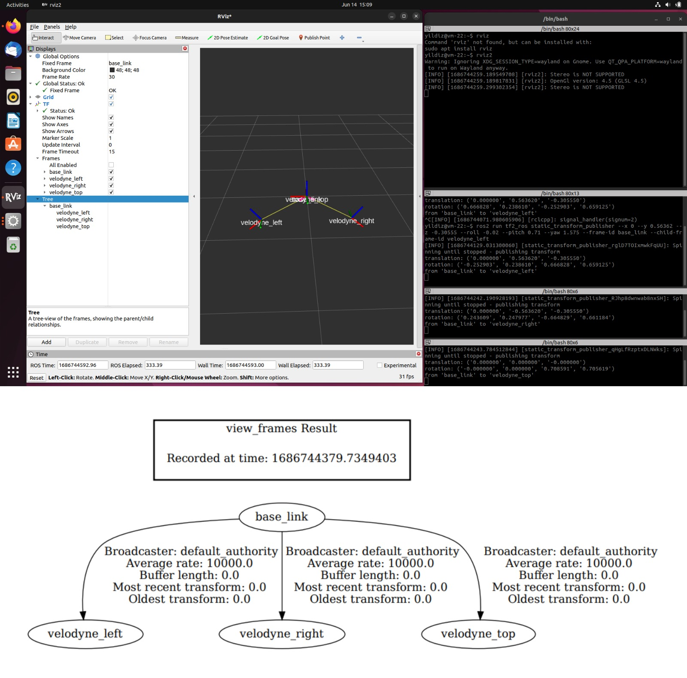
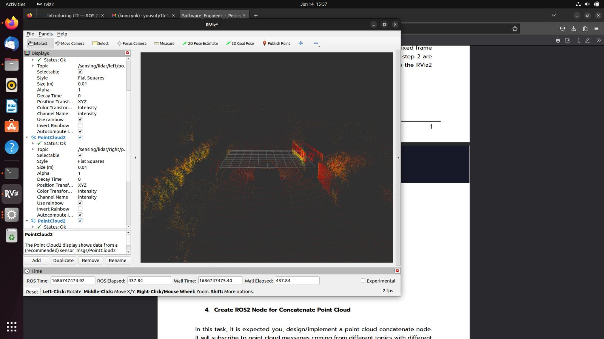
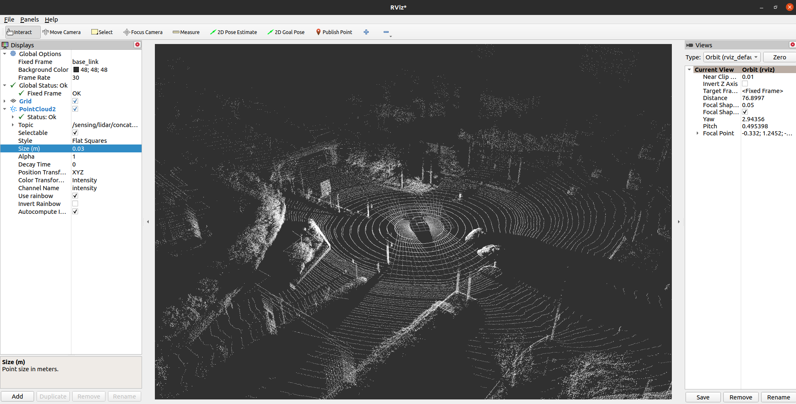

# PointCloud Concatenator

This package is created to take more than one of LIDAR poincloud stream as ROS2 subscriber then, transform their frames given with static_transform_publisher tf2, and hence concatenate the input streams to output stream publisher.


## Installation

If not installed, install ROS2 with distrubution you want. (Foxy and Humble is tested.)

Then, install this package and build as below:

```bash 
mkdir yildiz_ws/src -p && cd yildiz_ws/src
git clone https://github.com/yusufy1ld1z/point_cloud_concatenator.git
cd ..
source /opt/ros/<your_distro>/setup.bash
colcon build
```
Then, source the local_setup
```bash
source ./install/local_setup.bash
```

    
## Usage
#### Run Static Transforms
Open 3 terminals to run tf2 static_transform_publisher  
For the usage of static_transform_publisher:
```bash
source /opt/ros/<your_distro>/setup.bash
ros2 run tf2_ros static_transform_publisher --help
```
On each one of the terminals, source the ROS2
```bash
source /opt/ros/<your_distro>/setup.bash
```
In terminal1:
```bash
ros2 run tf2_ros static_transform_publisher 0 0.56362 -0.30555 1.575  0.71 -0.02 base_link velodyne_left
```
In terminal2:
```bash
ros2 run tf2_ros static_transform_publisher 0 -0.56362 -0.30555 -1.580 0.71 -0.01 base_link velodyne_right
```
In terminal3:
```bash
ros2 run tf2_ros static_transform_publisher 0.0 0.0 0.0 1.575 0.0 0.0 base_link velodyne_top
```
You can edit the transformation values and frame_id's as you desired.

#### Download Bag and Play
You can download the sample bag record by this [link](https://drive.google.com/file/d/1w_73D_xaNjjJ53TaiWFaS1yeNwVsQ1NE/view?usp=sharing).

Then extract the file to any folder and play it
```bash
ros2 bag play -l assignment_bag_0.db3 
```
#### Run the Node
Now, run the point_cloud_concatenator in which the terminal you sourced the local_setup.bash
```bash
ros2 run point_cloud_concatenator pc_concatenate 
```
### Visualize
You can simply open rviz2, and change the fixed_frame to base_link, then add the topic "/sensing/lidar/concatenated_point_cloud".
```bash
rviz2
```
## Images
- The output frame_tree and rviz2 shots of the static_transform_publisher




- The image of the not concatenated pointcloud streams




- And the result poincloud stream of the point_cloud_concetanator on rviz2




  
## License

[MIT](https://choosealicense.com/licenses/mit/)

  
